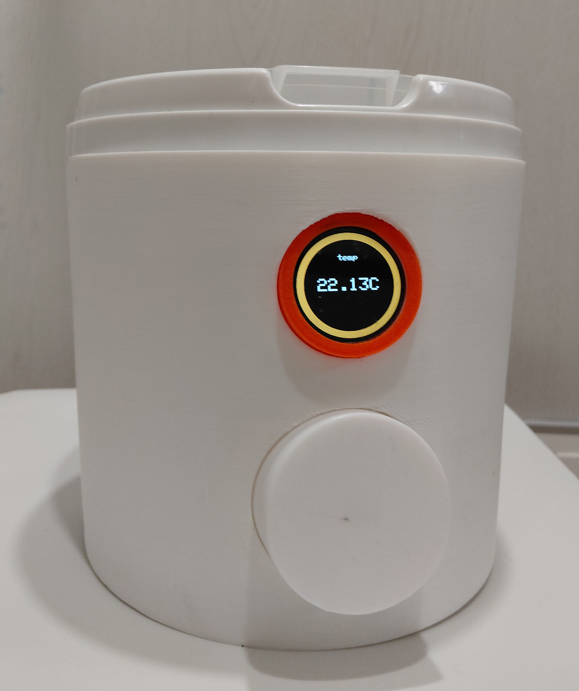
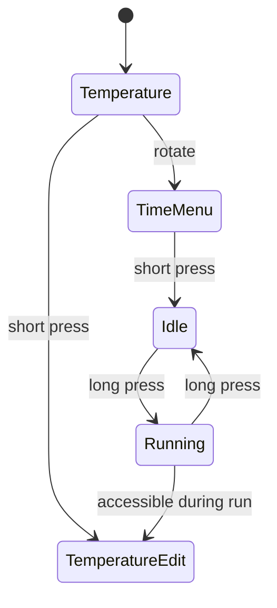
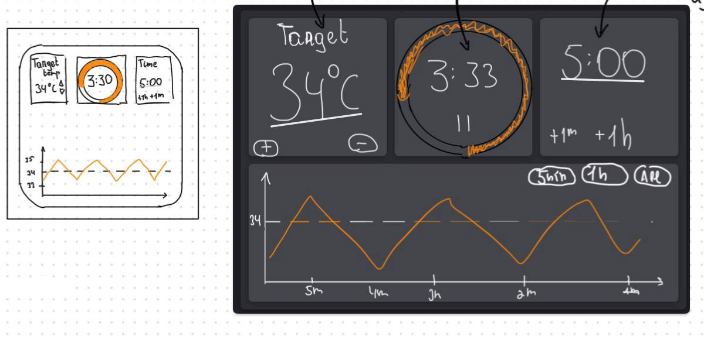
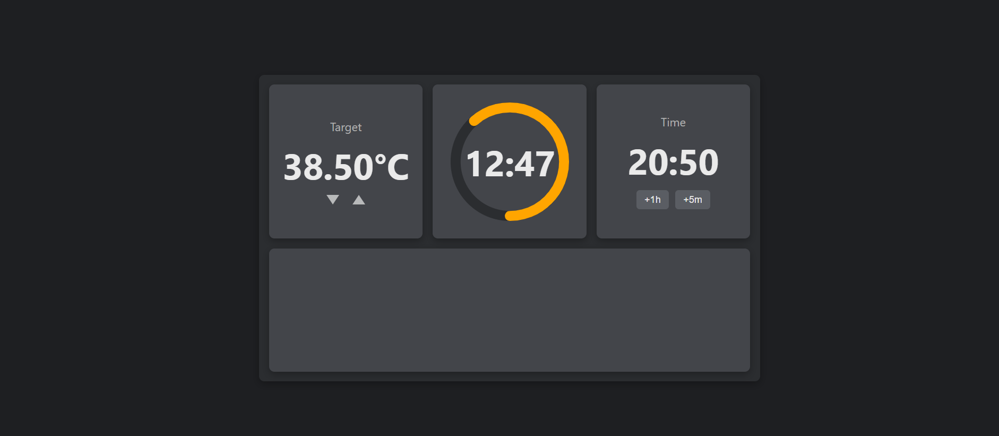

# Smart Fermentation IoT

A broken yogurt maker became an opportunity to build a complete embedded control system — combining real-time temperature regulation, a finite state machine UI, and remote control over Wi-Fi.

<table> <tr> <td align="center"><br><b>CAD Model (Fusion 360)</b></td> <td align="center"><br><b>Final Build</b></td> </tr> </table>

The enclosure and PCB were designed before assembly, resulting in a close match between the digital model and the physical device.

---

## Overview
This project is not just a household appliance, but a small embedded system combining:
- Real-time control (temperature regulation)
- Human-machine interface (FSM-driven UI)
- Network communication (Wi-Fi + HTTP API)

---

## Features

- Closed-loop temperature control (hysteresis-based)
- FSM-driven user interface (encoder + button)
- Adjustable temperature and timer (editable during operation)
- Web interface for remote control
- Smart Home integration via Wi-Fi
- Temperature logging via serial output

---

## Architecture

The firmware is structured as a finite state machine (FSM), where each state encapsulates its own behavior and input handling.

Instead of a monolithic `switch-case` , each state is implemented as a class inheriting from a common `State` interface:

```C++
class State {
protected:
    FSM* fsm;

public:
    virtual void onShortPress() {};
    virtual void onLongPress() {};
    virtual void onRotate(int dir) {};
    virtual void running() {};

    virtual StateType getType();
    void setFSM(FSM* fsmPtr) { this->fsm = fsmPtr; }
    virtual ~State() {};
};
```

### Navigation Logic:

The FSM architecture helped eliminate early logic bugs and makes the system easily extensible.


### Design properties

- Each state defines its own reactions to input events
- No global branching logic
- Easy extensibility: adding a state = adding a class
- Clear separation between UI behavior and control logic

### Example: Running state

```C++
void RunningState::onShortPress() {
    this->fsm->timer.pause();
    this->fsm->changeState(new IdleState());
}

void RunningState::onLongPress() {
    this->fsm->changeState(new TimeEditingState());
}

void RunningState::onRotate(int dir) {
    this->fsm->changeState(new TemperatureState());
}
``` 

The main loop delegates execution to the active state, which updates only the necessary parts of the UI.

---

## Temerature Control
Temperature is controlled using hysteresis switching instead of PID.

### Reasoning
- PID with relay control requires frequent switching → reduces relay lifespan
- Thermal inertia of the system reduces the need for tight control
- Full-power heating decreases time to reach target temperature

### Parameters

- Hysteresis band: ±0.25°C
- Sampling: periodic (main loop)
- No filtering applied

### Observed behavior

- Ramp-up overshoot: up to +4°C
- Steady-state accuracy: ±1–1.5°C
- Time to reach target (~42°C): 15–20 minutes (closed lid)

This trade-off favors simplicity and reliability over theoretical precision.

---

## Hardware

| Component      | Role               |
| -------------- | ------------------ |
| ESP32          | Main MCU + Wi-Fi   |
| DS18B20        | Temperature sensor |
| SSR-40A        | Heater control     |
| HLK-10M05      | AC/DC power supply |
| Rotary encoder | User input         |
| TFT display    | UI                 |

### Design decisions
- **ESP32:** dual-core allows separation of UI and networking
- **SSR relay:** more reliable than mechanical relay (no wear from switching)
- **DS18B20:** simple and sufficient for required accuracy

### Limitations
- No sensor failure detection
- No watchdog / crash recovery
- Overheat protection implemented as simple cutoff

---

## Web Interface
<table> <tr> <td align="center"><br><b>UI Sketch</b></td> <td align="center"><br><b>Implementation</b></td> </tr> </table>

The ESP32 runs an HTTP server on a separate core.

### API Examples

```C++
POST /api/start
POST /api/pause
POST /api/set_time
```

### Behavior
- Client sends commands via REST-like endpoints
- State changes are immediately applied in firmware
- UI and web interface stay consistent

### Limitations
- No concurrency control (last request wins)
- No multi-client synchronization
- Polling-based updates (no WebSocket)

---

## System Behavior & Measurements
- Temperature logging available via serial output
- Overshoot during heating: ~4°C
- Stable regime: ±1–1.5°C
- Time to reach operating temperature: 15–20 minutes

These measurements confirm that hysteresis control is sufficient for fermentation use.

---

## UI Design Trade-offs
Using a single encoder + button for all interactions led to a complex and unintuitive interface.

### Observable issues
- Navigation and confirmation share the same input
- User flow becomes difficult to predict

Separating input roles is necessary.
In future it may be interesting to add a second dedicated button.

---

## Implementation Details
- UI optimized to update only changed elements (low display refresh rate)
- Temperature sensor required thermal coupling (thermal paste) for accuracy
- FSM architecture helped eliminate early logic bugs

---

### Lessons Learned (Post-Mortem)
| Decision      | Observation               | Future Improvement   |
| -------------- | ------------------ | ------------------ |
| Single Encoder Input          | Navigating and confirming with one button was unintuitive.   | Add a second dedicated button to separate navigation from confirmation. |
| Volatile Settings        | Settings are lost on power cycles. | Store setpoints in ESP32 Non-Volatile Storage (NVS). |
| Error Handling        | No sensor failure or crash recovery detection. | Implement a Watchdog timer and sensor health checks.|

---

### Repository Structure

```
├── Firmware/ 			# PlatformIO C++ Project
│   └── src/
│       ├── FSM/
│       ├── main.cpp
│       ├── temperature.h
│       ├── timer.h
│       └── webInterface.h
├── Hardware/ 			# Fusion 360 Models & KiCad Schematics
│   ├── MainAssembly.f3d
│   └── Shema/
├── WebInterface/ 		# HTML, CSS, and JavaScript
└── Images/			# Project documentation assets
```

---

# Stack
- Firmware: C++ (PlatformIO)
- Hardware design: KiCad, Fusion 360
- Web: HTML / CSS / JavaScript
- Connectivity: Wi-Fi (ESP32), HTTP server
