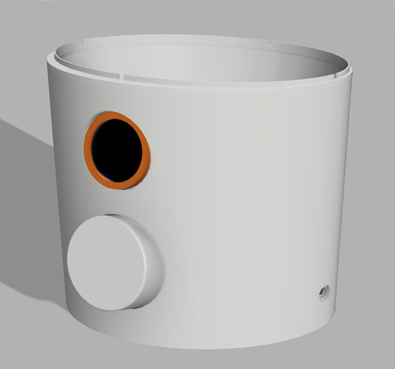
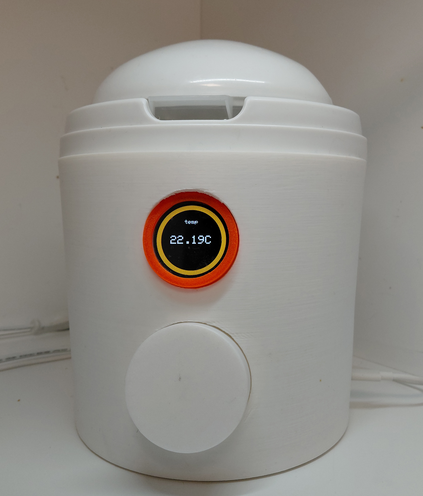

A broken yogurt maker became an opportunity to build one properly — with closed-loop temperature control, a state machine architecture, and remote monitoring over Wi-Fi.

<table>
  <tr>
    <td align="center"> <b>Digital Twin (Fusion360)</b></td>
    <td align="center"> <b>Final Build</b></td>
  </tr>
</table>

Технологии

Hardware: 
 - Микроконтроллер ESP32
 - Реле SSR-40A
 - Блок питания Hi-Link HLK 10M05
 - Энеодер
 - Круглый дисплей TFT 
 - Датчик температуры DS18B20

Firmware:
 - C++

Web:
 - HTML / CSS / JavaScript

Системная архитектура

Стандартная системная архитектура для встраеваемого прибора - основной цикл с вызовом модулей, соответствующих текущему режиму вовода.
Интересно выделить пользовательский интерфейс выполненный ввиде автомата состояний.

Так же интересно отметить PID контроль температуры выполненный через временные фреймы.

Web Interface 
Одной из причин выбора ESP32 в качетсве микроконтроллера был его встроенный wifi модуль, который позволил реализовать управление параметраими йогуртницы через веб интерфейс и интеграцию с существующей системой умного дома.

Разработка началась с анализа действие которые можно было бы выполнять на сайте.
1. Контроль температуры
2. Контроль таймера
3. Запуск

<Сюда наверное можно было бы вставить диаграмму случаем использования>

После этого я составил эскиз сайта
И написал его реализацию

<Сюда вставить рядом схему и реальный сайт>

<Тут наверное фотографии которые не вошли выше>
